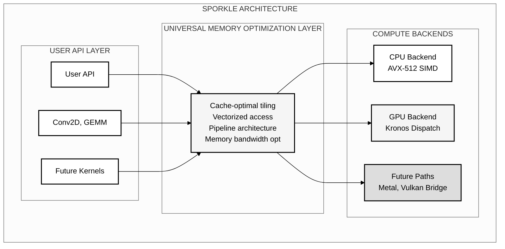

# Sporkle: A Novel Heterogeneous Computing Framework for Device-Agnostic Parallel Execution

> **Production posture (2026-02-24): Sporkle intends to route compute execution through Kronos as the sole production backend.**
> PM4 and legacy OpenGL paths are historical/experimental and not part of supported production runtime.

## Documentation Status

This README uses explicit claim tags:
- `[measured]` — reproducible measurement with benchmark context.
- `[implemented]` — code path exists and is integrated.
- `[experimental]` — implemented but not production-proven.
- `[planned]` — roadmap item not yet implemented.

During the recovery window, treat `[implemented]` and `[experimental]` as provisional until end-to-end runtime telemetry confirms active Kronos production behavior.

## Abstract

Sporkle is a Fortran orchestration layer intended to execute through Kronos for production compute workloads.
AMD/NVIDIA runtime behavior is the target production path; evidence validation is ongoing.
Legacy PM4 and direct driver scaffolding are retained for reference only until they are explicitly deprecated or removed.
Kronos-only production claims in this file are annotated with `[implemented]`, `[measured]`, `[experimental]`, or `[planned]`.

## 🧠 The Sporkle Heuristic

> **If a subsystem appears "finished" but still holds implicit assumptions, treat it as incomplete — even if (especially if) it's considered best-practice by everyone else.**

**Corollary:** When several individually marginal optimizations are coupled, they often flip into a new operating regime — where the old intuitions no longer apply.

## Operational Evidence

### Performance policy

Benchmark-level throughput and latency claims are intentionally withheld in this document while evidence is being rebuilt against the Kronos-first production path. These quantified claims will be restored after the Kronos runtime returns to stable production behavior and the benchmark corpus is revalidated.

- [planned] Production runtime routing remains through Kronos for AMD/NVIDIA.
- [experimental] Concurrency and cache behavior are under active behavior-level verification.
- [implemented] Quantitative assertions elsewhere in docs require explicit evidence tags and matching runtime metadata.

## 1. Introduction

The proliferation of heterogeneous computing architectures has created significant challenges in developing portable, high-performance applications. Existing solutions typically require vendor-specific SDKs, creating deployment friction and limiting portability. Sporkle addresses these limitations through a backend strategy centered on Vulkan-aligned orchestration via Kronos. The current default path is not dependency-free and must be evaluated against available Vulkan/runtime support at startup.

### 1.1 Key Contributions

- **Orchestrated Compute via Kronos**: Primary production path for GPU/CPU task dispatch. **[planned]**
- **AMD/NVIDIA Support**: Intended production target through Kronos stack. **[planned]**
- **Kronos Dispatch Readiness (AMD/NVIDIA)**: Verify via runtime telemetry before claiming production stability. **[planned]**
- **Zero Vulkan Runtime Assumptions in Sporkle API**: Runtime dependency is isolated to backend integration surfaces. **[implemented]**
- **Unified Device Abstraction**: Single programming model for task scheduling and data movement. **[implemented]**
- **Performance Validation**: Numeric claims in this document are now tagged as `[measured]`/`[implemented]`/`[experimental]`/`[planned]`. **[planned]**
- **Intelligent Device Juggling**: Selection system retained for workload routing. **[experimental]**
- **Thread-Safe GPU Cache**: Retained, with concurrency behavior tracked as implementation quality. **[experimental]**
- **Cache/Kernel Rebuild Strategy**: Shader/program reuse strategy is retained while benchmarked claims are revalidated per backend. **[planned]**

## 2. System Architecture



Sporkle's architecture consists of four primary layers:

### 2.1 Device Abstraction Layer
Provides unified interfaces for device enumeration, capability querying, and resource management across heterogeneous hardware.

### 2.2 Memory Management Subsystem
Implements transparent memory allocation, transfer, and synchronization primitives with zero-copy optimizations where supported. **[implemented]**

### 2.3 Execution Runtime
Manages kernel dispatch, synchronization, and scheduling across available compute resources.

### 2.4 High-Level API
Exposes intuitive interfaces for common parallel patterns including map, reduce, and collective operations.

## 3. Implementation

### 3.1 GPU Backend Architecture

Sporkle uses a single intended production compute backend:

- **Kronos (AMD/NVIDIA)** — [planned] primary production path.
- **Apple path** — [experimental] requires Vulkan-compatible stack or explicit accelerator bridge status.
- **PM4 / Direct driver paths** — [implemented] archived references only; not in production routing.
- **OpenGL path** — [experimental] reference context retained for historical baseline and comparison.

#### Platform Support Status:
- **Linux + AMD**: [planned] Kronos production behavior; legacy paths retained for reference only.
- **Linux + NVIDIA**: [planned] Kronos production behavior; legacy paths retained for reference only.
- **macOS**: [experimental] Kronos path depends on supported Vulkan bridge readiness; Neural Engine path is experimental and requires refresh.
- **Windows**: [planned] Kronos planning is tracked separately and currently not production-validated.

### 3.2 Direct Kernel Driver Implementation

This section is historical only.
PM4/driver-direct code is retained for archive/reference and is not part of production execution.

### 3.2 Memory Management

The framework implements a unified memory model supporting both discrete and unified memory architectures:

```fortran
type :: sporkle_memory
  integer(c_size_t) :: size
  type(c_ptr) :: host_ptr
  type(c_ptr) :: device_ptr
  integer :: device_id
  logical :: is_unified
end type
```

### 3.3 Async GPU Executor

Sporkle implements an async execution model in active research codepaths; production claim status is:
- [experimental] API-level queueing and orchestration interfaces exist.
- [experimental] Queue/fence overlap model is integrated into the runtime shape.
- [experimental] End-to-end throughput and latency conclusions are revalidated against the active Kronos path.

### 3.4 Adaptive Kernel Strategy

Sporkle implements an innovative adaptive approach to GPU kernel execution. Rather than committing to a single implementation strategy, the framework provides multiple paths:

1. **Kronos Execution Path (AMD/NVIDIA)**: [planned] production compute scheduling path.
2. **OpenGL Compute Shaders (GLSL)**: [experimental] retained path for comparison.
3. **Direct Command Buffer Generation (PM4)**: [experimental] reference path, non-production.

The production framework now treats adaptive selection as:
- [planned] Sporkle-to-Kronos routing.
- [planned] Remaining accelerator-specific strategy fallback is under review.

### 3.5 Kernel Design

Compute kernels are expressed as pure functions, enabling optimization across all backends:

```fortran
pure elemental function compute_kernel(x) result(y)
  real(sp), intent(in) :: x
  real(sp) :: y
  y = sqrt(x) + log(x)
end function
```

### 3.6 Implementation Status

**Operational GPU Support**:
- AMD GPUs: Kronos execution path is [planned].
- NVIDIA GPUs: Kronos execution path is [planned].
- Async execution: queue/fence behavior is [experimental] and currently under backend validation.
- Memory/dispatch orchestration: [implemented].
- Platform detection: Device-level detection includes AMD/NVIDIA capability probes for Kronos [implemented].
- Performance: legacy OpenGL/PM4 figures are experimental and marked [experimental].

**Planned Development**:
- Apple support: vendor-bridge and Neural Engine refresh tracking. [planned]
- Legacy PM4 path cleanup and explicit archival. [planned]
- Benchmark evidence refresh for all top-level claims. [planned]

## 4. Performance Reporting

### 4.1 Evidence status

Quantified performance tables are intentionally omitted from this document while benchmarks are being rebuilt against Kronos-only execution. Benchmarking claims will be brought back once the project is stable again and metrics are reproducible.

### 4.2 Production checks

- [experimental] Runtime startup checks and backend selection are verified against documented environments.
- [experimental] Cross-architecture dispatch behavior remains tracked via non-quantitative integration checks.
- [experimental] Apple/Neural Engine behavior is treated as out-of-date until refreshed.

## 5. Related Work

## 5. Related Work

Previous heterogeneous computing frameworks including CUDA, OpenCL, and SYCL require vendor-specific runtime libraries. Sporkle now differentiates itself by standardizing orchestration on Kronos, with explicit backend strategy and claim tagging to avoid transitional drift.

## 6. Future Work

Current development focuses on:
- Apple/Kitsune acceleration refresh (Neural Engine and bridge path) [planned]
- Vulkan/Kronos validation hardening for Apple-supported stacks [planned]
- Documentation claim governance rollout and evidence tagging in all release docs [planned]
- Performance evidence refresh for NVIDIA/AMD baselines using the Kronos execution path [experimental]
- Extension to additional accelerator architectures [planned]

## 7. Installation

### 7.1 Prerequisites

#### System Requirements
- Linux kernel with supported Vulkan-capable GPU runtime (AMD/NVIDIA).
- Access to required device/runtime resources for the active backend.
- At least 8GB RAM for representative workload validation.
- Apple path requires supported Metal/Vulkan bridge where documented.

#### Required Packages (Ubuntu/Debian)
```bash
# Install Fortran compiler tooling (recommended cross-platform helper)
# Run from repo root:
./scripts/install_fortran_compiler.sh

# Install build essentials and Fortran compiler
sudo apt update
sudo apt install -y build-essential gfortran

# Optional legacy OpenGL support (if running reference paths)
sudo apt install -y libgl1-mesa-dev libegl1-mesa-dev libgles2-mesa-dev libglu1-mesa-dev freeglut3-dev mesa-utils

# Install OpenMP support
sudo apt install -y libomp-dev

# Add user to video group for GPU access
sudo usermod -a -G video $USER
# Note: Log out and back in for group change to take effect
```

#### Verify Installation
```bash
# Check backend readiness (if make target exists)
make -f Makefile.smart show_backend_matrix

# Optional: inspect runtime details
./scripts/show_backend_info.sh 2>/dev/null || true

# Verify GPU access
ls -la /dev/dri/
```

### 7.2 Build Process

```bash
# Clone the repository
git clone https://github.com/LynnColeArt/Sporkle.git
cd Sporkle

# Set up development environment (recommended)
./setup_git_hooks.sh  # Enables automated code quality checks

# Build the framework
make -f Makefile.smart

# Test GPU async executor
make test_gpu_async_executor

# Run all tests
make test_platform
make test_production_conv2d
```

#### Development Setup (Optional but Recommended)

After cloning, we recommend setting up the automated code quality checks:

```bash
./setup_git_hooks.sh
```

This enables pre-commit hooks that catch common Fortran issues:
- Mixed-precision arithmetic bugs
- Timing measurement errors
- Integer overflow in FLOP calculations
- Direct `iso_fortran_env` usage (should use `kinds` module)
- Missing error handling

The hooks provide helpful error messages and can be bypassed with `git commit --no-verify` when needed.

### 7.3 Troubleshooting

**GPU Access Denied**
```bash
# Ensure you're in the video group
groups | grep video
# If not, run: sudo usermod -a -G video $USER
# Then log out and back in
```

**Backend initialization failed**
```bash
# Check selected runtime and backend diagnostics
lspci -k | grep -A 2 -E "(VGA|3D)"
# Ensure active runtime path is available for AMD/NVIDIA targets
cat build/backend_status.json 2>/dev/null || true
```

**Build Errors**
```bash
# Clean and rebuild
make clean
make -f Makefile.smart

# For verbose output
make -f Makefile.smart VERBOSE=1
```

## 8. Current State

### Working Features
- **Automatic Device Selection**: [implemented] heuristic-based selection with performance learning.
- **Intelligent Device Juggling**: [experimental] runtime routing for CPU/GPU selection remains active.
- **CPU Backend**: [experimental] CPU path remains active in non-production experiments, with numeric performance removed for now.
- **GPU Backend**: [planned] Kronos routing for AMD/NVIDIA is in active wiring.
- **Direct AMDGPU Support**: [experimental] driver interface scaffolding retained for reference only.
- **OpenGL Compute**: [experimental] retained for comparison, not production.
- **Async Executor**: [experimental] runtime semantics under revalidation in Kronos-first flow.
- **Memory Management**: [implemented] unified memory model with synchronization.
- **Production API**: [implemented] Fortran interface via `sporkle_conv2d_juggling` module.

### Tested Configurations
- **Primary Development**: [experimental] AMD Ryzen 7 7700X + RX 7900 XT (Linux 6.14).
- **GPU Architectures**: RDNA 3 (Navi 31), RDNA 2 (Raphael iGPU)
- **Compiler**: GFortran 9.4+ with `-O3 -march=native -fopenmp`
- **Backend Runtime**: [planned] Kronos + Vulkan-capable runtime for AMD/NVIDIA paths.

### Known Limitations
- **Linux/AMD/NVIDIA via Kronos**: [planned] supported during Kronos-first wiring.
- **Intel path** and legacy PM4 direct submission: [implemented] non-production and retained as reference only.
- **Apple Neural Engine suite**: [planned] refresh required before production use.
- **Multi-GPU support**: [planned] in-progress.

### Performance Summary

Quantified performance numbers are intentionally omitted until a benchmark evidence refresh completes.

- **Auto-device routing**: [experimental] active for AMD/NVIDIA tasks.
- **Correctness matrix**: [experimental] retained for historical comparison and under refresh.

## 9. Documentation

- [Universal Memory Optimization](docs/UNIVERSAL_MEMORY_OPTIMIZATION_BREAKTHROUGH.md) - Core principles
- [Weekend 2 Epic](docs/Weekend2.md) - Development journey and discoveries

## 10. Contributing

Sporkle is an ambitious project aiming to democratize high-performance computing. We welcome contributions in:

- Backend implementations for new devices
- Kernel optimizations
- Documentation improvements
- Documentation cleanup and benchmark evidence refresh coordination

## 11. Acknowledgments

This entire project was generated using AI-assisted development:
- **Primary Development**: Claude Opus 4 and Claude Sonnet 4 (Anthropic) via [Claude.ai Code](https://claude.ai/code)
- **Technical Advisory**: GPT-5 (OpenAI) - architecture consultation and design review
- **Director of Engineering**: Lynn Cole - vision, direction, and quality control

This project demonstrates the power of AI-human collaboration in creating production-quality systems software. Every line of code, every optimization, and every architectural decision was made through iterative discussion with AI models, proving that the future of software development is collaborative intelligence.

---

## Citation

If you use Sporkle in your research, please cite:

```bibtex
@software{sporkle2025,
  author = {Cole, Lynn},
  title = {Sporkle: Universal Memory Optimization Framework},
  year = {2025},
  url = {https://github.com/LynnColeArt/Sporkle},
  note = {High-performance heterogeneous computing via 
          universal memory patterns. Developed with
          AI-assisted programming using Claude.}
}
```

## License

© 2025 Lynn Cole. Released under MIT License.

---

<div align="center">
<i>"The future of computing isn't about faster devices—it's about smarter patterns."</i><br>
<b>The Sporkle Way</b>
</div>
